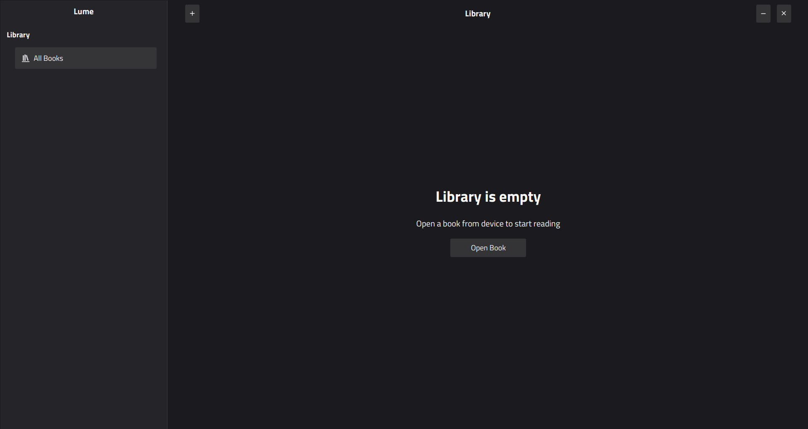

# Lume: A Desktop E-Reader
[](https://www.loom.com/embed/dc69d97d58424c22ba5b61d69f0c9059?sid=964896d7-1ff0-4b26-ba28-deab97e5bcdb)

**Lume** is a desktop e-book reader for the EPUB format, built with JavaFX, created as part of our CSE108 Project. It includes features for annotation, collaborative reading on a single computer, and an AI assistant for answering questions about the book's content.

---

## ✨ Features

-   **EPUB Reader**: A clean, paginated reading interface for `.epub` files.
-   **Annotation & Bookmarking**: Highlight text with different colors. Your progress and annotations are saved and reloaded automatically.
-   **Local Collaboration**:
    -   **Shared Annotations**: When multiple instances of Lume are running on the same computer, annotations made in one window appear instantly in the others.
-   **AI-Powered Q&A**:
    -   Uses the Google Gemini API to answer questions about the book's content, characters, and plot points.
-   **Customizable Reading View**:
    -   Adjust font family and size to your preference.

---

## 🛠️ Tech Stack

-   **Framework**: [JavaFX](https://openjfx.io/)
-   **EPUB Processing**: [epublib](https://github.com/psiegman/epublib)
-   **AI Integration**: [Google Gemini API](https://ai.google.dev/docs/gemini_api_overview)
-   **Data Handling**: [Jackson](https://github.com/FasterXML/jackson)
-   **Build Tool**: [Maven](https://maven.apache.org/)
-   **Language**: Java

---

## 🚀 Getting Started

Follow these instructions to get a local copy up and running.

### Prerequisites

-   **Java Development Kit (JDK)**: Version 11 or higher.
-   **Maven**: For managing dependencies and building the project.
-   **Gemini API Key**: You need an API key from Google AI Studio to use the "Ask AI" feature.
    -   Get your key from [Google AI Studio](https://aistudio.google.com/app/apikey).

### Installation & Running

1.  **Clone the repository:**
    ```sh
    git clone https://github.com/fahim07ms/Lume
    cd Lume
    ```

2.  **Set up the Gemini API Key:**
    The application looks for your API key in an environment variable named `GEMINI_API_KEY`.

    -   **On Windows (Command Prompt):**
        ```sh
        setx GEMINI_API_KEY "YOUR_API_KEY_HERE"
        ```
        (You may need to restart your terminal or IDE for this to take effect.)

    -   **On macOS/Linux:**
        ```sh
        export GEMINI_API_KEY="YOUR_API_KEY_HERE"
        ```
        (To make this permanent, add this line to your `~/.bashrc` or `~/.zshrc` file.)

3.  **Build and Run with Maven:**
    Navigate to the root directory of the project in your terminal and run the following command:
    ```sh
    ./mvnw clean javafx:run
    ```
    Maven will download the necessary dependencies and launch the application.
---
Note: The CSS may not load in some Windows computers. 
